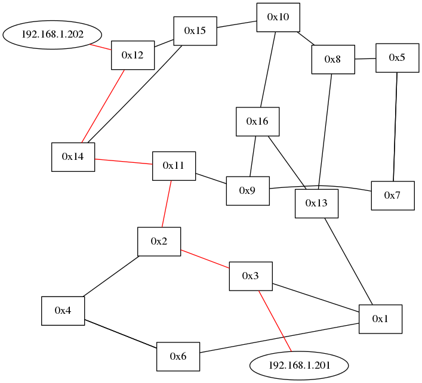

# レポート課題
> 1. ルーティングスイッチを実機で動かす
> 2. 最短経路をGraphvizで表示する  
  トポロジ図にルーティングスイッチが設定した最短路を赤く表示

## コードの解説
簡単なので無し  
ダイクストラ法で算出した経路を赤くするだけ

## 動作確認
実機のスイッチに各VLANのポート数が3ポートになるように設定し，VLANを16個用意する．  
そして，全48ポートのうち，46ポートを適当にケーブリング(スイッチ0x5 - 0x7間，0x4 - 0x6間はマルチグラフ)し，残り2ポートはそれぞれPCに接続させ動作確認を行った．  

2つのPC間でパケット(ping)を送信をし，最短経路を示したトポロジ画像を出力させた．    
なお，PCのIPアドレスはそれぞれ``192.168.1.201``，``192.168.1.202``とした． 
 
パケット送信後の出力画像(最短経路を示したトポロジ図)を以下に示す．  
正常にPC間の最短経路が赤く示されていることが出力画像から分かる．  
また，全てのスイッチから3本のエッジが伸びており(スイッチ0x5 - 0x7間，0x4 - 0x6間は見えにくいが2本ある)，VLANの設定も正しく行えていることが伺える．

終わりなんだ(*^◯^*)
