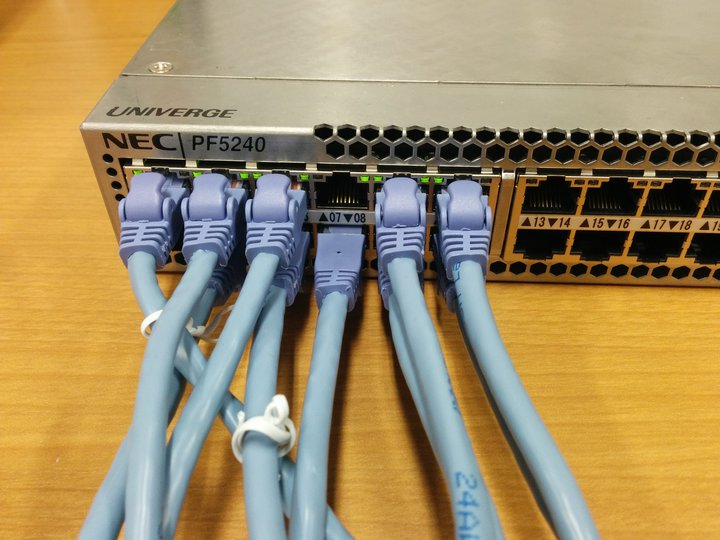
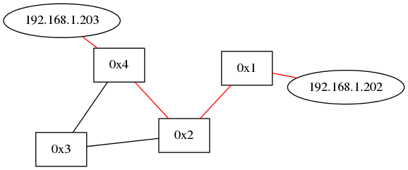
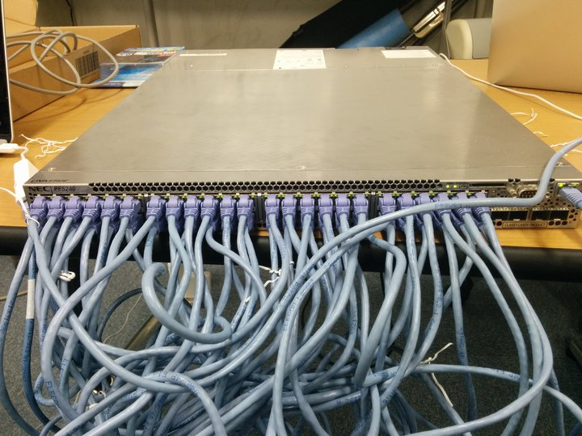
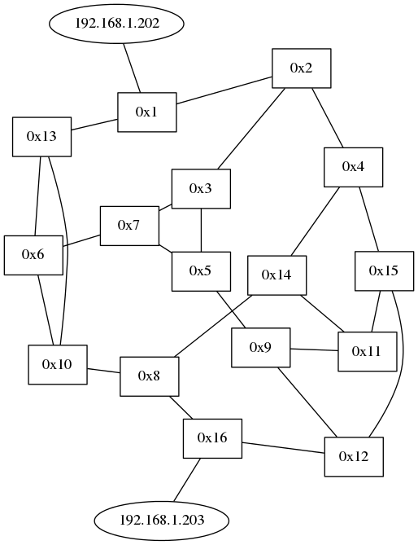

# レポート課題
> 1. ルーティングスイッチを実機で動かす
> 2. 最短経路をGraphvizで表示する  
  トポロジ図にルーティングスイッチが設定した最短路を赤く表示
  (packet_inが発生し最短パスを見つける度にその経路を赤く表示する)

## 役割分担
* コード作成：@yamatchan, @k-nakahr  
* VSI設定：@s-kojima, @sunya-ch
* report.md作成：@yamatchan, @s-kojima

## コードの解説
### コンセプト
* ARP解決もできるようにする
* 次回の演習に向けて汎用性の高いコードにする
* プログラムフローをわかりやすくするため，無駄なハンドラを追加しない

### Gemfile
graphvizでトロポジ画像を生成するため，Gemfileに``gem 'ruby-graphviz'``を追加した．

### vendor/topology/lib/view/graphviz.rb
Graphvizクラスは常に最新のネットワークトポロジをインスタンス変数に保持しておき，  
最短パスが見つかる度にPathManagerクラスが``Graphviz#update_shortest_path``を呼び出し，トポロジ画像を更新する手法を取った．  

最新のネットワークトポロジのリンクの集合をA，最短経路に含まれているリンクの集合をBとしたとき，  
A-Bのリンクを黒く，Bのリンクを赤くすることで，最短経路を赤く表示することが可能となる．

### lib/path_manager.rb
既存のPathManagerクラスは，ネットワークトポロジ上のホストをMACアドレスで管理しているが，  
後述するARP解決の処理で，ARPパケットは宛先MACアドレスが``FF:FF:FF:FF:FF:FF``となっているため，  
ホストをMACアドレスで管理していると，ARPパケットを正しく転送することができない．  
そのため，ネットワークトポロジ上のホストをIPアドレスで管理することにした．

### vendor/topology/lib/topology.rb
``lib/path_manager.rb``で述べたように，ネットワークトポロジ上のホストをIPアドレスで管理するため，  
PathManagerクラスに``#add_host``ハンドラを投げる際に，引数としてIPアドレスを渡すように変更をした．

### vendor/topology/lib/command_line.rb
Tremaをコンソール上で起動する際に，毎回graphvizオプションをつけるのが面倒なので，
デフォルトで``Graphviz mode``となるように仕様を変更した．

### lib/routing_switch.rb
PathManagerクラスから``Graphviz#update_shortest_path``が呼び出せるようにするために，  
``@path_manager``に``graphviz``オブジェクトを渡している．

### vendor/topology/lib/topology_controller.rb
ARPパケットがpacket inした際に，送信元ホストをネットワークトポロジに追加しようとするが，  
インスタンス変数``@source_ip_address``が定義されていないため，エラーが発生しプログラムが終了してしまう．  
そのため，ネットワークトポロジにホストを追加する条件をIPv4パケットのときのみに制限することにした．

## 動作確認
### 小規模のネットワーク
まず，トポロジ画像の生成が正しく行えているかを確認するために小規模のネットワークを構成し動作確認を行った．  
以下の写真のように，実機のスイッチにVSIを4個用意し，適当にケーブリングし，さらにPC端末を2台接続した．  

2つのPC間でパケット(ping)を送信し，最短経路を示したトポロジ画像を出力させた．    
なお，PCのIPアドレスはそれぞれ``192.168.1.202``，``192.168.1.203``とした．

パケット送信後の出力画像(最短経路を示したトポロジ図)を以下に示す．  
以下の画像より正常にトポロジ画像が出力されていることが分かる．   

### 大規模のネットワーク
次に，VSIの設定及び最短経路の出力が正しく行えているかを確認するために大規模のネットワークを構成し動作確認を行った．  
実機のスイッチに各VSIのポート数が3ポートになるように設定し，VSIを16個用意する．  
そして，全48ポートのうち，46ポートを適当にケーブリングし，残り2ポートはそれぞれPCに接続させ動作確認を行った．  

Trema起動直後のトポロジ画像を以下に示す．  
全てのスイッチから3本のエッジが伸びており，VSIの設定も正しく行えていることが伺える．  

Trema起動後，2つのPC間でパケット(ping)を送信し，最短経路を示したトポロジ画像を出力させた．    
なお，PCのIPアドレスはそれぞれ``192.168.1.202``，``192.168.1.203``とした．  
パケット送信後の出力画像(最短経路を示したトポロジ図)を以下に示す．  
正常にPC間の最短経路が赤く示されていることが出力画像から分かる．  

終わりなんだ(*^◯^*)

